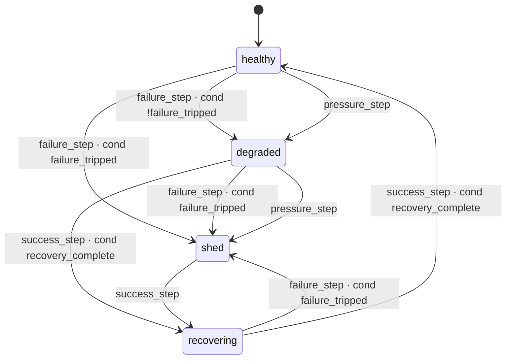

```mermaid
stateDiagram-v2
    [*] --> healthy
    healthy --> degraded : failure_step · cond !failure_tripped
    healthy --> shed : failure_step · cond failure_tripped
    healthy --> degraded : pressure_step
    degraded --> shed : failure_step · cond failure_tripped
    degraded --> recovering : success_step · cond recovery_complete
    degraded --> shed : pressure_step
    shed --> recovering : success_step
    recovering --> shed : failure_step · cond failure_tripped
    recovering --> healthy : success_step · cond recovery_complete
```
