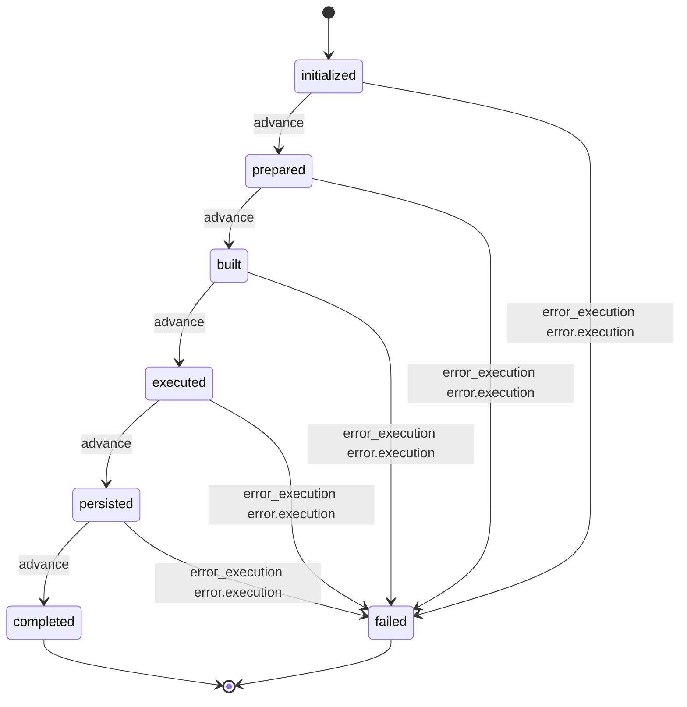

```mermaid
stateDiagram-v2
    [*] --> initialized
    initialized --> prepared : advance
    initialized --> failed : error_execution error.execution
    prepared --> built : advance
    prepared --> failed : error_execution error.execution
    built --> executed : advance
    built --> failed : error_execution error.execution
    executed --> persisted : advance
    executed --> failed : error_execution error.execution
    persisted --> completed : advance
    persisted --> failed : error_execution error.execution
    completed --> [*]
    failed --> [*]
```
