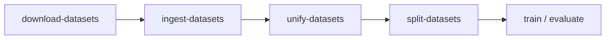

# {octicon}`terminal;1em` Data Pipeline Scripts

The four scripts in `src/scripts` prepare BBQ + StereoSet for
training/evaluation. They form a **deterministic pipeline**:



## {octicon}`book;1em` Script catalog

| Script | Role |
|---|---|
| {octicon}`download;1em` `download-datasets` | Downloads BBQ and StereoSet source files from configured URLs. |
| {octicon}`database;1em` `ingest-datasets` | Parses downloaded files and inserts normalized rows into the database. |
| {octicon}`git-merge;1em` `unify-datasets` | Transforms and samples entries into `UnifiedBiasEntry` records. |
| {octicon}`git-branch;1em` `split-datasets` | Creates stratified train/dev JSON splits. |

## {octicon}`code-square;1em` CLI options and examples

::::{tab-set}

:::{tab-item} download

**Key options**

- `--output-dir/-o` — destination folder for raw files.
- `--config/-c` — YAML config path.
- `--force/-f` — overwrite existing files.
- `--log-level` — `DEBUG | INFO | WARNING | ERROR`.

```bash
uv run download-datasets \
    --output-dir datasets \
    --config configs/config.yaml \
    --force \
    --log-level INFO
```
:::

:::{tab-item} ingest

**Key options**

- `--db-url` — async SQLAlchemy URL (default SQLite).
- `--output-dir` — directory containing downloaded files.
- `--config` — YAML config path.

```bash
uv run ingest-datasets \
    --db-url sqlite+aiosqlite:///./datasets.db \
    --output-dir datasets \
    --config configs/config.yaml
```
:::

:::{tab-item} unify

**Key options**

- `--db-url` — source/target unified DB URL.
- `--force/-f` — truncate existing unified table before rebuild.

```bash
uv run unify-datasets \
    --db-url sqlite+aiosqlite:///./datasets.db \
    --force
```
:::

:::{tab-item} split

**Key options**

- `--db-url` — source DB URL.
- `--train-ratio` — train split ratio (e.g. `0.5`).
- `--seed` — deterministic split seed.
- `--output-dir` — where `trainset.json` + `devset.json` are
  written.

```bash
uv run split-datasets \
    --db-url sqlite+aiosqlite:///./datasets.db \
    --train-ratio 0.5 \
    --seed 42 \
    --output-dir datasets/splits
```
:::

::::

## {octicon}`play;1em` Recommended execution order

```bash
uv run download-datasets
uv run ingest-datasets
uv run unify-datasets
uv run split-datasets
```

:::{important}
- Use a **consistent seed** across runs you intend to compare.
- Use `--force` only when intentionally rebuilding artefacts.
- Keep `--db-url` and output directories consistent across all
  four scripts.
:::

## {octicon}`link;1em` Related

- {doc}`/guides/how_to/troubleshooting`
- {doc}`/guides/reference/data`
- {doc}`/api/data`
