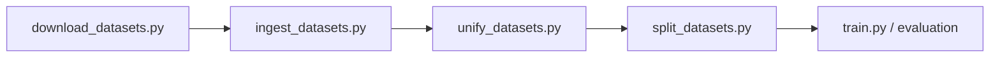

# Data Pipeline Scripts

This page documents the project scripts in `src/scripts` used to prepare datasets before training/evaluation.

## Overview

The scripts form a deterministic pipeline:

1. download raw benchmark files,
2. ingest raw files into SQL models,
3. unify datasets into a common MCQ schema,
4. split unified data into train/dev sets.

## Pipeline Diagram



## Script Catalog

- `download_datasets.py`: downloads BBQ and StereoSet source files from configured URLs.
- `ingest_datasets.py`: parses downloaded files and inserts normalized rows into the database.
- `unify_datasets.py`: transforms and samples entries into `UnifiedBiasEntry` records.
- `split_datasets.py`: creates stratified train/dev JSON splits.

## CLI Options and Examples

### `download_datasets.py`

Key options:

- `--output-dir/-o`: destination folder for raw files.
- `--config/-c`: YAML config path.
- `--force/-f`: overwrite existing files.
- `--log-level`: `DEBUG|INFO|WARNING|ERROR`.

Example:

```bash
uv run download-datasets \
	--output-dir datasets \
	--config configs/config.yaml \
	--force \
	--log-level INFO
```

### `ingest_datasets.py`

Key options:

- `--db-url`: async SQLAlchemy URL (default SQLite).
- `--output-dir`: directory containing downloaded files.
- `--config`: YAML config path.

Example:

```bash
uv run ingest-datasets \
	--db-url sqlite+aiosqlite:///./datasets.db \
	--output-dir datasets \
	--config configs/config.yaml
```

### `unify_datasets.py`

Key options:

- `--db-url`: source/target unified DB URL.
- `--force/-f`: truncate existing unified table before rebuild.

Example:

```bash
uv run unify-datasets \
	--db-url sqlite+aiosqlite:///./datasets.db \
	--force
```

### `split_datasets.py`

Key options:

- `--db-url`: source DB URL.
- `--train-ratio`: train split ratio (e.g. `0.5`).
- `--seed`: deterministic split seed.
- `--output-dir`: where `trainset.json` and `devset.json` are written.

Example:

```bash
uv run split-datasets \
	--db-url sqlite+aiosqlite:///./datasets.db \
	--train-ratio 0.5 \
	--seed 42 \
	--output-dir datasets/splits
```

## Recommended Execution Order

```bash
uv run download-datasets
uv run ingest-datasets
uv run unify-datasets
uv run split-datasets
```

## Notes

- Use consistent random seed settings across runs to keep split reproducibility.
- Use `--force` options where available when intentionally rebuilding artifacts.
- Keep database URL and output directories consistent across all script steps.

## Related Pages

- {doc}`/guides/how_to/troubleshooting`
- {doc}`/guides/reference/data`
- {doc}`/api/data`
