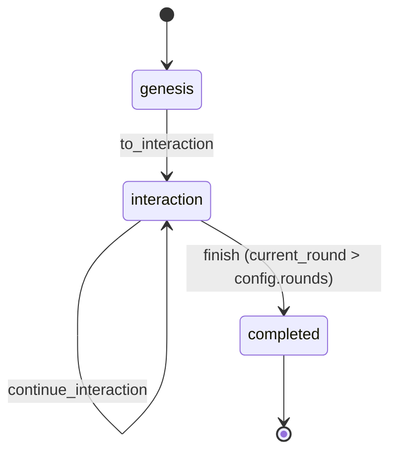
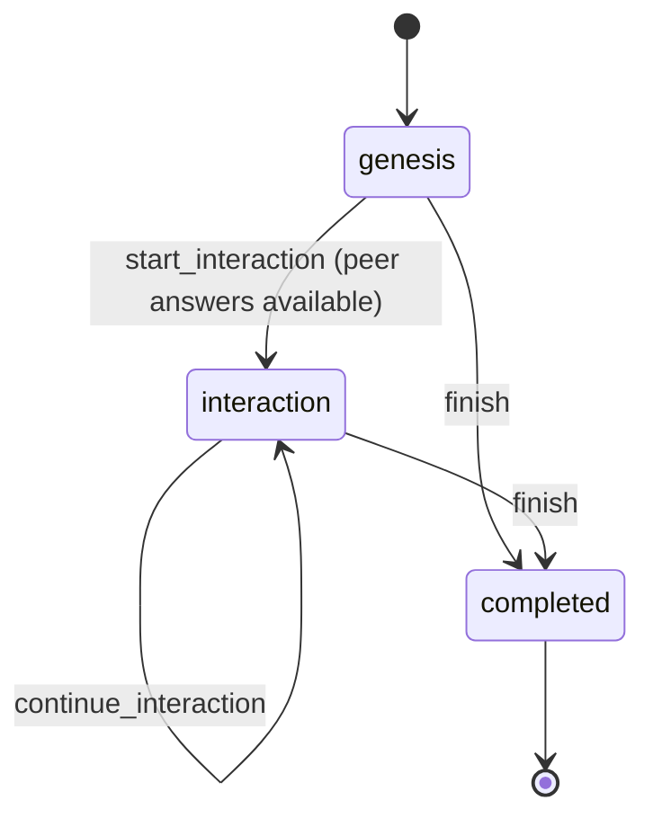
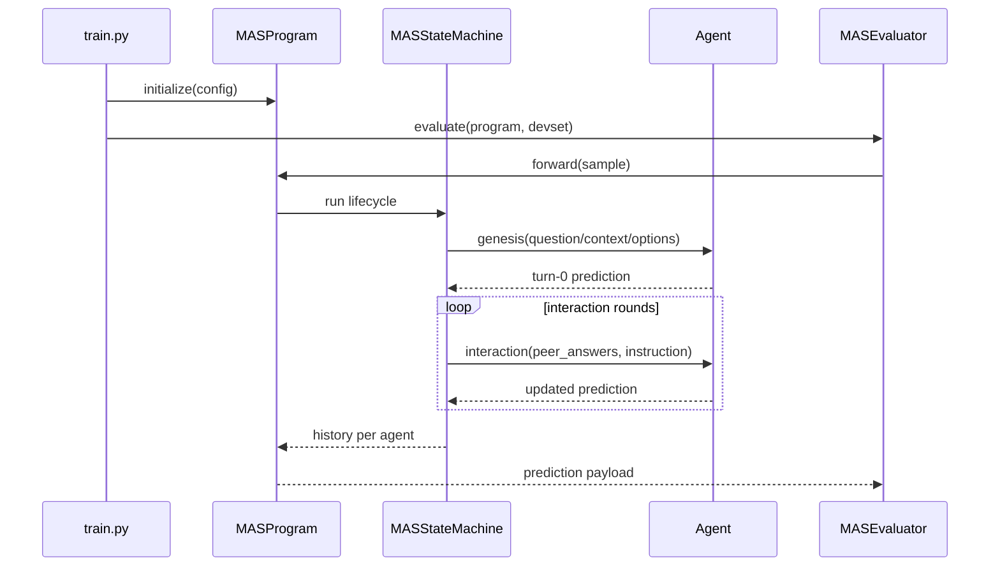
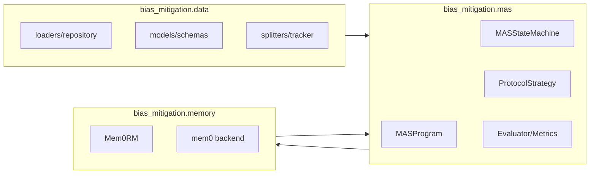
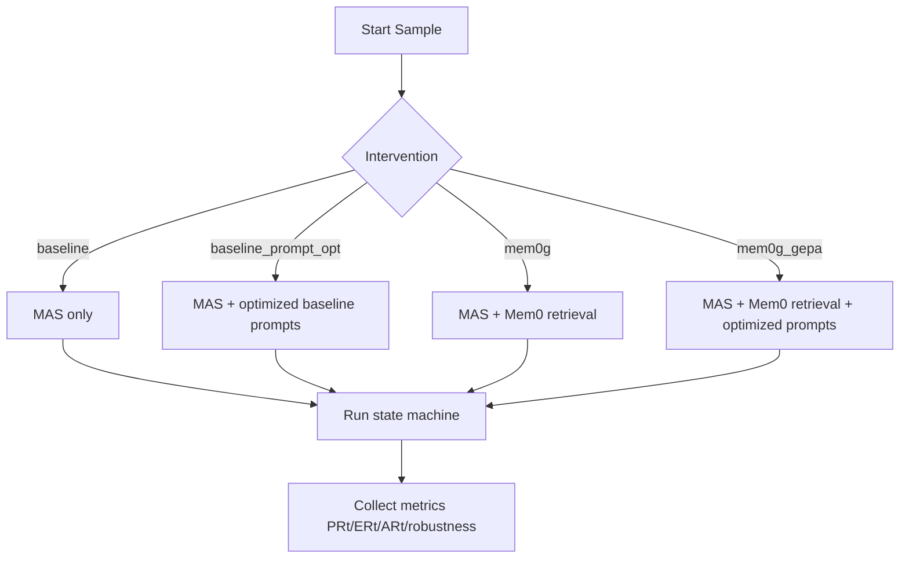
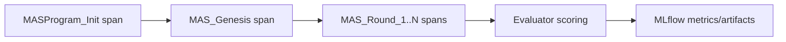

# System Architecture

This page documents the runtime architecture used to execute one evaluation sample in the Multi-Agent System (MAS).

## Runtime Components

- `MASProgram`: top-level DSPy module that prepares agents, intervention wiring, and executors.
- `MASStateMachine`: lifecycle controller for genesis and interaction rounds.
- `ProtocolStrategy`: provides system prompts and round-update instruction semantics.
- `Mem0RM` (optional): retrieval backend activated for memory interventions.

## State Machine Flow

The run follows a fixed lifecycle:

1. **Genesis phase**
   - Each agent receives context, question, options, and group-conditioned system prompt.
   - One prediction per agent is produced and stored as turn 0.
2. **Interaction rounds**
   - For each round, each agent receives peer answers from the previous turn.
   - The configured protocol determines the update instruction.
   - One updated prediction per agent is appended per round.
3. **Completion**
   - The machine exits after configured rounds and returns ordered per-agent histories.

## Agent Lifecycle Flow

Each agent also uses a local lifecycle state machine for phase-specific behavior.

Memory interaction semantics:

- Retrieval runs during `interaction` phase only.
- Memory persistence runs after each generated prediction.
- Memory clear/reset is controlled at MAS lifecycle level (`reset_memory_on_genesis`).

Memory clear policy semantics:

- `none` (`reset_memory_on_genesis: false`): recommended default for run-scoped user IDs; avoids cleanup overhead.
- `on_genesis` (`reset_memory_on_genesis: true`): clears each agent session at genesis start; improves strict isolation but adds extra backend I/O.

## Execution Sequence

## Component Boundaries

## Intervention Flow

## Observability Flow

## Diagram Conventions

Use the following style conventions across documentation diagrams:

- **Shapes**:
   - Rectangles (`[]`) for runtime components/processes.
   - Diamonds (`{}`) for decisions/branching conditions.
   - Rounded states in `stateDiagram-v2` for lifecycle states.
- **Directionality**:
   - Prefer left-to-right (`LR`) for architecture and data pipelines.
   - Use top-to-bottom (`TD`) for intervention branch logic.
- **Naming**:
   - Use code identifiers in backticks when referenced in prose.
   - Keep node labels concise and action-oriented.
- **Color/Semantics Policy**:
   - Do not encode meaning with color only; rely on node labels and structure.
   - If colors are later introduced, include textual legend entries.
- **Maintenance Rule**:
   - Any lifecycle/configuration change in `MASProgram`, `MASStateMachine`,
      intervention routing, or data pipeline scripts must update relevant diagrams
      in this page and `guides/how_to/scripts.md` in the same PR.

## Reproducibility Invariants

- State progression is declarative and deterministic at the control-flow level.
- One genesis output plus `N` interaction outputs per agent for `N` rounds.
- Memory state is reset between test cases for memory-based intervention conditions.
- Traces are emitted through MLflow spans for phase and round observability.

## Design Rationale

The architecture separates concerns between orchestration (`MASProgram`), lifecycle (`MASStateMachine`),
conversation policy (`ProtocolStrategy`), and memory intervention (`Mem0RM`).
This keeps execution auditable while allowing controlled intervention comparisons.
