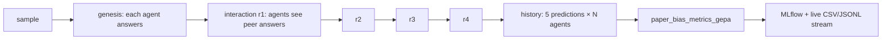

# Bias Mitigation in Multi-Agent Systems

**A 2×2 factorial study** of bias propagation between cooperating LLM
agents, and of two interventions for reducing it — Mem0-backed graph
memory between turns, and GEPA reflective prompt optimisation.

:::{dropdown} {octicon}`telescope;1em` Study at a glance
:animate: fade-in-slide-down
:color: primary
:open:

Two open-weight models are paired in every debate: a **Llama 3.1-8B
Instruct** model and a **DeepSeek-R1** distilled into the same 8B
backbone. Each sample is drawn from **BBQ + StereoSet**, runs four
interaction rounds under a configurable protocol (cooperative /
debate / competitive / malicious), and yields a per-turn trajectory
of predictions per agent.

The two factors — memory on/off, prompt optimisation on/off — define
four arms. Per-category stratification (gender, race, religion,
profession, …) is a **first-class deliverable**, since BBQ + StereoSet
are categorically structured and the per-category lens is the most
reviewer-relevant slice.
:::

## {octicon}`beaker;1em` The four arms

| Arm | Memory | Prompt | Purpose |
|---|---|---|---|
| `baseline` | off | factory | Control. |
| `baseline_opt` | off | GEPA | Isolates the prompt-optimisation effect. |
| `mem0g` | on | factory | Isolates the memory effect. |
| `mem0g_gepa` | on | GEPA | Joint treatment — is the combination super-additive? |

## {octicon}`graph;1em` What is measured per sample

| Outcome | Code | Type | Direction |
|---|---|---|---|
| {octicon}`shield-check;1em` System robustness | `mas/metrics.py::system_robustness` | continuous $\in [0, 1]$ | ↑ better |
| {octicon}`hourglass;1em` Emergence (turn of first bias) | `mas/metrics.py::emergence_rate` | **censored survival** (`-1` = never) | later better |
| {octicon}`broadcast;1em` Propagation rate $PR_t$ &nbsp; *(primary)* | `mas/metrics.py::propagation_rate` | continuous $\in [0, 1]$ | ↓ better |
| {octicon}`flame;1em` Amplification rate | `mas/metrics.py::amplification_rate` | $P(\text{biased at final} \mid \text{biased at genesis})$ | ↓ better |

The four feed both per-sample MLflow scorers and the GEPA composite
metric (`paper_bias_metrics_gepa`, declared in
`mas/metrics.py::_GEPA_METRICS`).

:::{warning}
`Emergence` is **survival-encoded** downstream — averaging the `-1`
censoring sentinel is the most common mistake against this outcome,
so the analysis layer routes it through `lifelines`-style
Kaplan–Meier estimators instead of a paired Wilcoxon.
:::

## {octicon}`question;1em` Hypotheses and design

::::{tab-set}

:::{tab-item} Hypotheses

- **H0** — no difference in mean $PR_t$ between baseline and the
  memory arm.
- **H1** — `mem0g` reduces $PR_t$ vs `baseline`.
- **H2** — `mem0g_gepa` reduces $PR_t$ vs `mem0g` (additional gain
  beyond memory alone).
:::

:::{tab-item} Paired design

Each sample is run under all four arms with the **same agent pair,
seed, and protocol**. Contrasts are within-pair, not between-group,
so the analysis uses `statsmodels` **MixedLM + GEE** rather than a
paired Wilcoxon — paired Wilcoxon would discard the per-category
covariance structure and inflate the degrees of freedom.
:::

:::{tab-item} Per-category lens

BBQ + StereoSet group samples by **gender, race, religion,
nationality, age, disability, sexual orientation, profession,
socio-economic, physical appearance**. Per-category disparities are
computed with `fairlearn.MetricFrame` and reported alongside the
pooled $PR_t$ contrast — not as a robustness check, but as the
headline finding.
:::

:::{tab-item} Protocol lock

The hypothesis family, multiple-comparison correction, and outcome
list are locked by **SHA-256 over the `HypothesisRegistry`** in
`bias_mitigation.analysis.registry`. Any silent change to H0/H1/H2
is detected on a re-run, which guarantees the analysis cannot be
quietly redefined after seeing the data.
:::

::::

## {octicon}`workflow;1em` How a sample runs



Memory **recall + store** wrap each agent's interaction step when the
intervention is `mem0g*`. The full state machines are auto-generated
from the class bodies — see
[Architecture](guides/reference/architecture.md).

## {octicon}`graph;1em` Analysis flow

Per-sample streaming rows land in
`evaluation/analysis/live/<run_dir>/`. The analysis package
(`bias_mitigation.analysis`) is a polars chain over those streams
plus a small `statsmodels` / `scipy` / `lifelines` adapter layer,
feeding three thin notebooks:

| Notebook | What it produces |
|---|---|
| `notebooks/01_paired_main_effects.ipynb` | Within-pair contrasts for the 2×2 factorial. **MixedLM + GEE** so the paired design's df is not inflated. |
| `notebooks/02_emergence_survival.ipynb` | **Kaplan–Meier + CoxPH** on the censored `Emergence` outcome. Lifecycle-state Markov summary. |
| `notebooks/03_sensitivity_and_confounders.ipynb` | Per-metric **Manski bounds**, paired mediation, and negative controls. |

## {octicon}`package;1em` Stack

| Concern | Library |
|---|---|
| Lifecycle (MAS, agent, memory orchestration, workflow) | `python-statemachine` |
| Memory backend | `mem0.AsyncMemory` |
| Retry + circuit breaker | `tenacity`, `purgatory` |
| DI wiring | `dependency-injector` |
| Prompt optimisation | DSPy + GEPA |
| Experiment tracking | `mlflow` |
| Live-runs analysis | `polars`, `scipy.stats.bootstrap`, `statsmodels`, `lifelines` |
| Stratified fairness disparities | `fairlearn.MetricFrame` |

## {octicon}`rocket;1em` Run one arm

::::{tab-set}

:::{tab-item} Install

```bash
uv sync
```
:::

:::{tab-item} Train

```bash
uv run train --config-path configs/mas_config.yaml --intervention baseline
```

Swap `--intervention` for `baseline_opt`, `mem0g`, or `mem0g_gepa`.
:::

:::{tab-item} Evaluate

```bash
uv run evaluate --config-path configs/mas_config.yaml --subset 1500
```
:::

:::{tab-item} Analyse

```bash
uv run analyze \
    --live-root evaluation/analysis/live \
    --output-root evaluation/analysis/scientific_notebook_outputs \
    --group-by intervention,protocol,dataset_name,model_name \
    --bootstrap-samples 2000
```
:::

::::

See [Quickstart](get_started/quickstart.md) for the full four-arm
sequence + evaluation + analysis.

## {octicon}`book;1em` Where to look

::::{grid} 1 2 2 3
:gutter: 2

:::{grid-item-card} {octicon}`hourglass;1em` Quickstart
:link: get_started/quickstart
:link-type: doc
:shadow: md

Install, train each arm, evaluate, analyse — the whole loop on one
page.
:::

:::{grid-item-card} {octicon}`codescan;1em` Architecture
:link: guides/reference/architecture
:link-type: doc
:shadow: md

How one sample runs end-to-end. Auto-generated state-machine
diagrams for MAS, agent, memory, and workflow.
:::

:::{grid-item-card} {octicon}`graph;1em` Metrics
:link: guides/reference/metrics
:link-type: doc
:shadow: md

Define or extend a scorer; how the GEPA composite is wired to
`_GEPA_METRICS`.
:::

:::{grid-item-card} {octicon}`database;1em` Data + scripts
:link: guides/how_to/scripts
:link-type: doc
:shadow: md

Dataset pipeline:
`download → ingest → unify → split`. BBQ + StereoSet schemas in
[Data reference](guides/reference/data.md).
:::

:::{grid-item-card} {octicon}`bug;1em` Troubleshooting
:link: guides/how_to/troubleshooting
:link-type: doc
:shadow: md

Hangs, pressure events, embedder dimension drift, mem0 telemetry on
SIGINT, Sphinx-build failures.
:::

:::{grid-item-card} {octicon}`sync;1em` Reproducibility
:link: guides/reference/reproducibility
:link-type: doc
:shadow: md

Keep two runs comparable: fixed `num_agents`, `rounds`, `protocol`,
seed, and memory reset between cases.
:::

:::{grid-item-card} {octicon}`tools;1em` Developer guide
:link: guides/developer/index
:link-type: doc
:shadow: md

Contributing, testing, and the
[maintenance contract](guides/developer/maintenance.md) — which
docs you must touch when you edit which code.
:::

:::{grid-item-card} {octicon}`code-square;1em` API reference
:link: api/index
:link-type: doc
:shadow: md

Module-level reference generated from the source. Start at
`bias_mitigation.mas` or `bias_mitigation.analysis`.
:::

::::

```{toctree}
:maxdepth: 2
:hidden:

get_started/quickstart
guides/reference/index
guides/how_to/index
guides/developer/index
api/index
```
